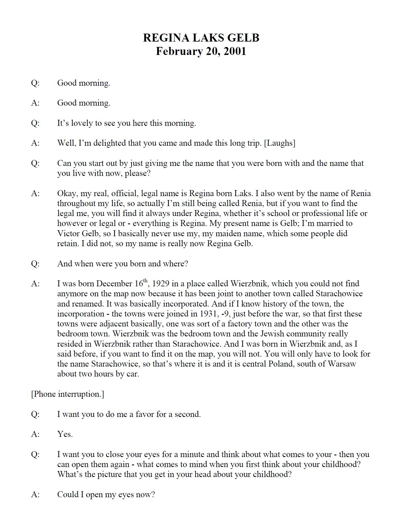

# About

This repository houses the notebooks for downloading and processing the oral testimonies found on the United States Holocaust Memorial Museum website. To learn about this project, you can read the [blog post](blog.md).

## Sample of Testimony Page

