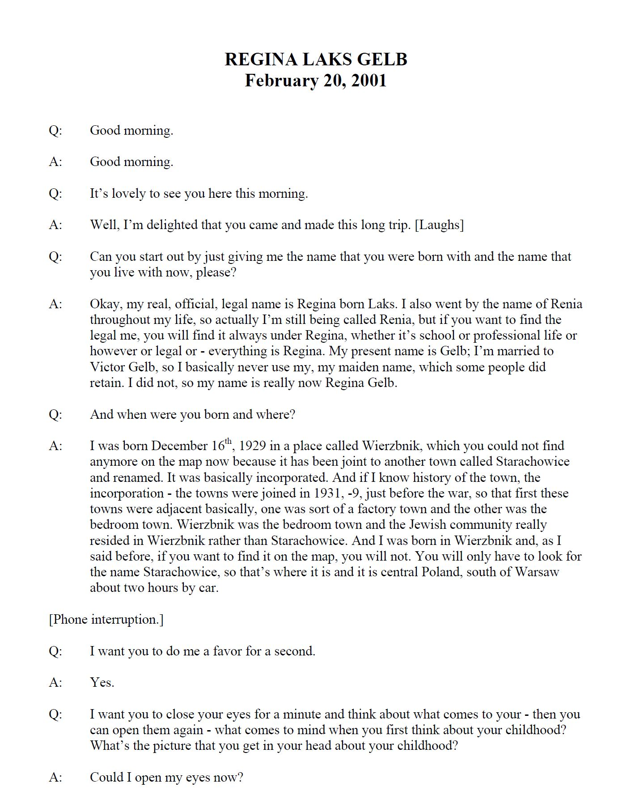

# Working with Oral Testimonies as Data

In this blog post, we will explore some of the challenges of working with oral testimonies as data. We will also cover some solutions and methodological steps you can make in working with these types of documents programmatically, or through  automation. For our case study, we will use a collection of over 1,000 English oral testimonies from the United States Holocaust Memorial Museum. In this blog, we will cover:

- Downloading the PDFs in bulk
- OCRing them with Tesseract
- Converting the raw text to structured data
- Methodological considerations for structuring the data programmatically

Throughout this blog, I will provide snippets of Python code that I will briefly explain. The goal here is to provide the reader with some of the code necessary for following along with the methodology of this blog. For a more in-depth look at the code, please see the `notebooks` subdirectory of this [repository](https://github.com/wjbmattingly/ushmm-holocaust-testimonies). There, you will find notebooks dedicated to narrow tasks described in this blog.

# Background

Before we jump in, however, let's cover a bit of background information about me and my work. For those who do not know, I work in the field of multilingual natural language processing, specifically applying NLP solutions to historical documents and museum archives. I am attached to the [Smithsonian Institution's Data Science Lab](https://datascience.si.edu/) as the digital humanities postdoctoral fellow. My appointment is split, however, between the [American Women's History Initiative](https://affiliations.si.edu/american-womens-history-initiative/) at the Smithsonian and the [United States Holocaust Memorial Museum (USHMM)](https://www.ushmm.org/). At the latter, I have worked with the oral testimonies for nearly two years. In addition to this, I have also worked with oral testimonies from South Africa's Truth and Reconciliation Commission (TRC) for the [Bitter Aloe Project](https://bitteraloeproject.createuky.net/).

Throughout this blog post, I will be drawing primarily from my personal experience in working with oral testimonies from both projects. I will be detailing some of the methodological challenges that transcend a single collection of oral testimonies. It is my hope that by approaching the problem in this way, the information I provide will be specifically related to USHMM oral testimonies, but broadly applicable to oral testimonies in other collections.

# Challenges of USHMM Oral Testimonies

The [USHMM oral testimony]((https://collections.ushmm.org/search/?f%5Bavailability%5D%5B%5D=transcript&f%5Bavailability%5D%5B%5D=english&f%5Bbrowse%5D%5B%5D=testimonies&page=1&per_page=100)) collection comprises over 2,000 transcribed testimonies of Holocaust survivors. Of these 2,000 testimonies, approximately 1,300 are in English. In this blog post, we will be working with a subset of approximately 1,100 that follow a similar schema, or way in which they are structured.



<i><center>Example of Testimony Page</center></i>

The testimonies themselves present certain challenges to those seeking to apply NLP methods to them. First, the individuals who gave oral testimony in English were not native speakers. In some cases, this results in the speaker having to express certain concepts in their first language. This means the models for parsing these types of documents should be multilingual in nature. This will help downstream tasks, such as named entity recognition or text classification.

This also leads to certain issues in the transcription. The transcriber of the original audio files was not necessarily present at the time of the oral interview and, in some instances, spells words phonetically. These are frequently concepts, places, or things in eastern Europe, potentially outside the knowledge of the transcriber. In other cases, the speaker will have an accent which prevents the transcriber from accurately transcribing the audio. This has resulted in noted gaps in certain testimonies which are often represented with `______`.

The testimonies are available as PDFs from the museum, but these PDFs present challenges of their own. First, they are encrypted which means the current OCR is difficult to extract programmatically. Second, the OCR has mistakes consistent with OCR of the early 2000s. Third, the raw text of the OCR is not structured which results in headers and footers frequently appearing alongside the main text. It also means that the data within a testimony is not tagged, so we cannot identify individual speakers or separate questions from answers. In other words, the PDFs in their original state contain unstructured text with frequent OCR errors.

Each of these challenges make working with the oral testimonies en masse difficult. The issues I have noted above are not unique to the USHMM oral testimonies. These are identical problems that surface when working with oral testimonies from other collections, such as the TRC in South Africa. There are other collections of Holocaust oral testimonies, such as those available from the USC Shoah Foundation. While these testimonies are structured with cleaned XML markup, the data is not open-source and requires permission to obtain.

# Download the Original PDFs from USHMM

Due to all the above issues, working with the USHMM testimonies as data requires us to go back to the original PDFs and re-OCR them. In order to do that, however, we first must download the files. We can do this in Python with `requests`, a library for making requests to servers programmatically.

Attached to this blog is a collection of notebooks that can be used to follow this workflow, including the downloading of the original PDFs. To save time, however, you can also access the page data for oral testimonies as a csv file in the `data` subfolder of this repository.

The CSV looks like the table below, where the page is the url for a given testimony. On that page sits a PDF transcript which can be downloaded.

|    | identifiers                                                             | date                        | page                                                   |
|---:|:------------------------------------------------------------------------|:----------------------------|:-------------------------------------------------------|
|  0 | Oral History , Accession Number: 2001.28 , RG Number: RG-50.030.0410    | interview: 2001 February 20 | https://collections.ushmm.org/search/catalog/irn512935 |
|  1 | Oral History , Accession Number: 2015.382.1 , RG Number: RG-50.106.0245 | interview: 2014 November 30 | https://collections.ushmm.org/search/catalog/irn185375 |
|  2 | Oral History , Accession Number: 2001.213.1 , RG Number: RG-50.969.0001 | Unknown                     | https://collections.ushmm.org/search/catalog/irn558424 |
|  3 | Oral History , RG Number: RG-50.999.0419                                | interview: 2013 April 25    | https://collections.ushmm.org/search/catalog/irn598532 |
|  4 | Oral History , RG Number: RG-50.030.0274                                | interview: 1995 August 18   | https://collections.ushmm.org/search/catalog/irn504758 |

To download a PDF on a particular page, you can make a request to the server and download the PDF directly via the following Python function:

```python
def download_pdf(url, DIR):
    '''
    This function will download the PDF of a specific testimony from a page on the USHMM website.
    ----
    Args:
        url (str) => the url of the USHMM page on which a PDF link sits
        DIR (str) = > the directory in which you wish for the PDFs to be saved
    '''
    s =  requests.get(url)
    soup = BeautifulSoup(s.content)
    pdf = ""
    for a in soup.find_all("a"):
        if "pdf" in a["href"]:
            pdf = a["href"]
    if pdf != "":
        s = requests.get(pdf)
        filename = pdf.split("/")[-1]
        with open(f"{DIR}/{filename}", "wb") as f:
            f.write(s.content)
    else:
        print(f"No available pdf for {url}")
```

# OCR with Tesseract

Once all the oral testimonies have been downloaded, we can then re-OCR them with Python and Tesseract (an OCR engine from Google) via `pytesseract`, a Python wrapper for the Tesseract OCR engine. It is important to remember, however, that a PDF is merely a collection of page images. We first need to convert a PDF to individual images that we can then process via Tesseract. To convert the PDFs to a series of images, we can use the `convert_from_path` class in the `pdf2image` library.

In Python, we would first want to import these libraries and classes.

```python
import glob
from pdf2image import convert_from_path
import pytesseract
```

We can then use `glob` to grab all the PDFs that contain the substring `trs_en.pdf`, which indicates that the PDF is an English transcript.

```python
files = glob.glob("pdfs/*trs_en.pdf")
len(files)
```

Once we have all the files, we can then iterate over each PDF, convert them to a collection of images, and then OCR each image. Finally, we can add the OCR of each image to a `text` string object. This will allow us to convert an entire PDF into a single string of raw text.

```python
for filename in files:
    pages = convert_from_path(filename, 500)
    text = ""
    for page in pages:
        res = pytesseract.image_to_string(page, config="--psm 6")
        text = text+res+"\n"
    ocr_filename = filename.replace("pdfs", "tesseract_ocr").replace(".pdf", ".txt")
    with open (ocr_filename, "w", encoding="utf-8") as f:
        f.write(text)
```

# The Architecture of a Testimony

Once we have our raw OCR output, we can begin thinking about how to parse the raw data. To do so requires serious methodological considerations about the architecture of a testimony.

When writing the Python code for parsing these testimonies (found in the next section), I thought about how to structure an oral testimony as data. In my earlier work, I worked primarily with USHMM testimonies where the paradigm was quite simple: the interviewer asked a question and the interviewee responded. As I began to work on testimonies outside the USHMM, such as the VHA testimonies of the Shoah Foundation and the oral testimonies from South Africa's TRC, I began to alter the way I thought about this paradigm.

The reason? Not all testimonies follow the question-answer format. 

Sometimes there are multiple interviewees or interviewers in a single testimony; at other times, the testimony records ambient noise or tertiary individuals, this is especially true with the VHA testimonies that reference when a background camera person says something. Each of these things suggest that a question-answer architecture is too rigid for structuring an oral testimony. Nevertheless, it is important to segment out the voices of the speakers.

When working with TEI-XML testimonies, such as those from the Shoah Foundation, this problem is solved because each speaker has a distinct markup tag. When working with real-world data, we are rarely so fortunate. Creating polished TEI-XML files is time consuming and much of the tagging is unnecessary for certain NLP tasks. For example, if one wanted to classify sections of a testimony that dealt with hunger and other sections that dealt with family, it would not make sense to invest hours into producing TEI-XML markup for one testimony when your research requires you to examine thousands of them en masse.

When working with real-world uncleaned text, parsing out the voice of the speakers can be challenging. Typically in an oral testimony, however, the transcript provides some clues as to when a particular voice changes. This will be different for each collection of testimonies. At the USHMM, we have the `Q: ` and  `A: ` markings before each section of dialogue. These indicate when the interviewer poses a question and when the interviewee answers. In the South African TRC testimonies (which are wildly inconsistent), we have different indicators, such as an individual's honorific followed by surname, e.g. `MR NKOSI`. It is important for you to examine your own collection and find the patterns that allow you, as a human, to parse the testimony on the page visually. Once you find the visual clues in the text that indicate a distinct person is speaking, you can begin to write rules that reflect that pattern for automating the parsing of the testimony. This will be a trial-and-error process.

# Converting Raw Text to Structured Data

When we have our raw OCR text, we can begin working with it via Python, however it is worth noting that the results of Tesseract will not be perfect. Common mistakes include '1n' for 'in', for example. These are common mistakes when OCRing and can be cleaned with a set of rules.

Some of the more challenging aspects of the raw text output lies in dealing with the headers and footers of the PDF page.

In addition to this, it is important to remember that the raw text output retains the line breaks of the original PDF. This means that sentences will be broken up into individual lines. Typically line breaks are singular between individual lines on the page and double between the segments of dialogue. But this is not always the case. Several factors can increase the number of line breaks, such as a page break. For this reason, it is important to standardize the line breaks on the page early in the parsing process.

The headers of a page need to be removed. This is what we would call unnecessary data. It is useful for humans when analyzing a PDF physical page, but will make certain NLP tasks much more challenging.


<i><center>Sample of a Header</center></i>

Finally, across all 1,100 testimonies there are certain inconsistencies. For example, most of the time a question receives a unique indication that a piece of dialogue is a question, e.g. "Q: ", but other times it can appear as "Question: ". In order to create rules for parsing raw text, it is good practice to ensure that your texts are standardized.

Most of these issues can be resolved with Regular Expressions (RegEx) via the sub function which is a more robust method for replacing a substring with another substring via Python when compared to the built-in string method of `.replace()`.

The below section of Python code will iterate over every OCR output from Tesseract. It will then go through a series of RegEx sub processes on the entire testimony. These standardize line breaks, the lead Qs and As for Question and Answer segments of dialogue, and remove the headers of the page.

Finally, it will iterate over each section of text. A section is considered any place where there is a double line break. Next, it will iterate over each line in a segment and structure the sequence in a dictionary called `collection`. This will retain the RG number of the testimony (used for USHMM cataloging), the sequence of the testimony (the sequential order of the dialogue), as well as the questions and answers of the testimony (when possible); finally, it also preserves the original preface data which usually occurs on the second page. This may be useful for some for downstream tasks as it contains information about the interviewee and the date of the interview.


<i><center>Sample of a Preface</center></i>

Finally, this Python code will save the JSON output in a subfolder of your choosing. In our case, this is `clean_ocr`.

```python
import glob
import re
import json

files = glob.glob("tesseract_ocr/*.txt")

for file in files:
    collection = {}
    with open(file, "r", encoding="utf-8") as f:
        item = f.read()
    file = file.split("\\")[-1].replace(".txt", "")
    if file.split(".")[1] == "562":
        print("found")
        break
    questions = []
    answers = []
    headers = []
    misses = []
    item = re.sub("\nA:", "\n\nA:", item)
    item = re.sub("\nAnswer:", "\n\nAnswer:", item)
    item = re.sub("\nQ:", "\n\nQ:", item)
    item = re.sub("\nQuestion:", "\n\nQuestion:", item)
    item = re.sub("\n\n\n", "\n\n", item)
    item = re.sub("http://collections.ushmm.org", "", item)
    item = re.sub("\nContact reference@ushmm.org for further information about tis collection\n", "", item)
    item = re.sub("Contact reference@ushmm.org for further information about this collection", "", item)
    item = re.sub("This is a verbatim transcript of spoken word. It is not the primary source, and it has not been checked for spelling or accuracy.", "", item)
    item = re.sub("\nInterview with.*\n", "", item)
    item = re.sub("\nUSHMM Archives.*\n", "", item)
    item = re.sub("\n\d{1,2}:\d{1,2}:\d{1,2}", "", item)
    
    while "\n\n\n" in item:
        item = item.replace("\n\n\n", "\n\n")
    sections = item.split("\n\n")
    sequence = []
    collection = {"rg": file, "sequence": [], "questions":[], "answers": [], "headers": [], "paragraph_breaks": []}
    # print(len(lines))
    for section in sections:
        lines = []
        for line in section.split("\n"):
            if "USHMM" not in line:
                lines.append(line)
            else:
                headers.append(line)
        section = "\n".join(lines)       
        if "Q:" in section or "question:" in section.lower():
            collection["questions"].append(section)
            sequence.append(section)
        elif "A:" in section or "answer:" in section.lower():
            collection["answers"].append(section)
            sequence.append(section)
        else:
            if collection["answers"]:
                sequence[-1] = f'{sequence[-1]}\n{section}'
                collection["answers"][-1] = f'{collection["answers"][-1]}\n{section}'
            else:
                collection["paragraph_breaks"].append(section)
    collection["sequence"] = sequence
    with open(f"clean_ocr/{file}.json", "w", encoding="utf-8") as f:
        json.dump(collection, f, indent=4)
```

# Conclusion

Working with text data changes depending on the type of documents we are working with. Hopefully this short blog post has given you a few ways to consider working with oral testimonies as data, as well as some basic Python for performing OCR on PDFs and processing of the raw text into structured data.